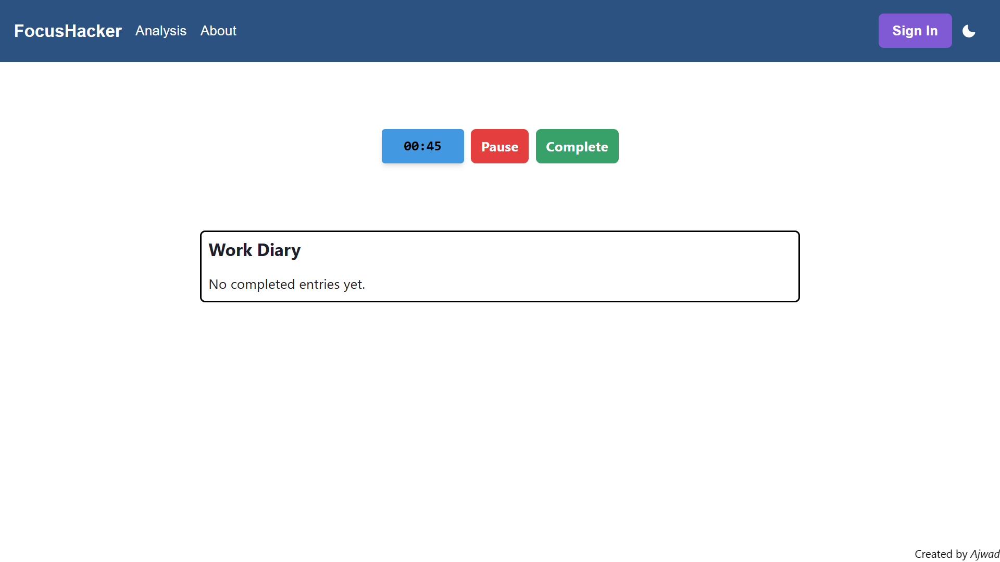
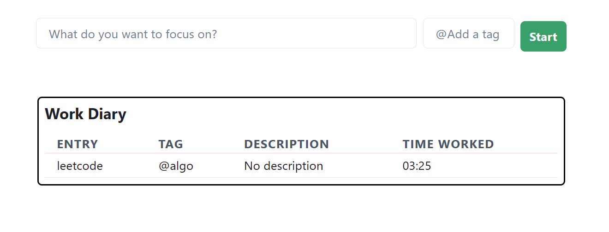
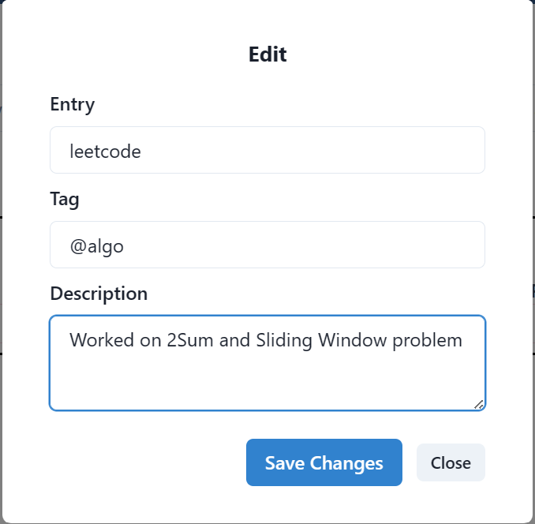

# README

 FocusHacker is a web application designed to help users track their tasks and improve their productivity. It includes a Work Diary where all your tagged completed entries will go and which you can explore in more detail to unlock your key time periods of productivity. 
 
 This README provides an overview of the project, instructions for getting started, and details on how to use the app effectively.

Home Page


Work Diary


Individual Entry's



## Table of Contents

- [Project Overview](#project-overview)
- [Features](#features)
- [Getting Started](#getting-started)
- [Usage](#usage)
- [Contributing](#contributing)
- [License](#license)

## Project Overview

The Productivity App is built using React and Chakra UI. It consists of two main components:

## Features

- Timer: The app includes a timer that tracks the time spent on each task.
- Task Entry: Users can enter their tasks and add optional tags to categorize them.
- Pause and Continue: The timer can be paused and continued as needed.
- Completed Entries List: The app keeps track of completed tasks and displays them in a table format.

## Getting Started

To run the Productivity App locally, follow these steps:

### Prerequisites

- Node.js installed on your machine.
- Python3 and Django installed

### Installation

1. Clone the repository: `git clone https://github.com/your-username/productivity-app.git`
2. Navigate to the project directory: `cd FocusHacker/frontend`
3. Install the dependencies: `npm install`
4. Run ```npm runserver```

For Backend
1. Navigate to `cd FocusHacker/backend`
2. Run ```python3 manage.py runserver` to fetch all your entries from the database

## Usage

1. Start the development server: `npm start`
2. Open your web browser and visit `http://localhost:3000` to access the app.
3. In the DialogBox component, enter a task in the input field and add a tag (optional).
4. Click the "Start" button to start the timer.
5. Once the task is completed, it will appear in the Completed Entries list, which is displayed in the CompletedEntries component.

## Contributing

We welcome contributions to the Productivity App project. If you would like to contribute, please follow these guidelines:

1. Fork the repository and create a new branch.
2. Make your changes and test them thoroughly.
3. Submit a pull request, describing the changes you've made and any additional information.

## License

The Productivity App is open-source software released under the [MIT License](https://opensource.org/licenses/MIT). You are free to use, modify, and distribute the code in accordance with the terms of the license.

## Acknowledgments

I would like to thank the Chakra UI and React communities for their excellent libraries and resources that have contributed to the development of this project.